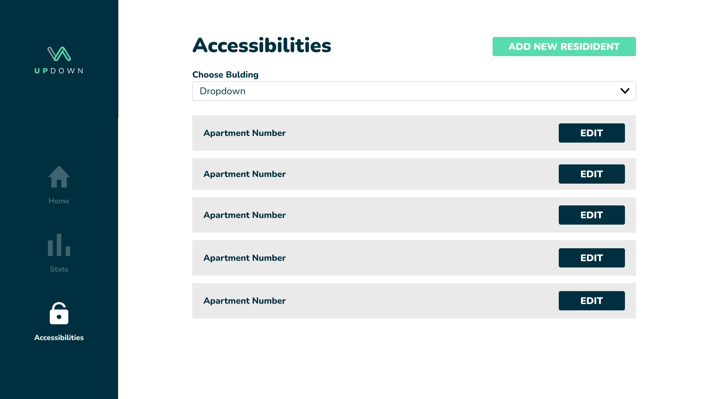
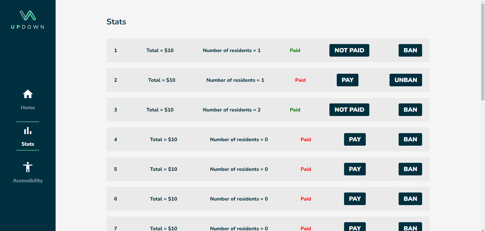

<div align="center">

> Hello world! This is the project’s summary that describes the project plain and simple, limited to the space available.

**[PROJECT PHILOSOPHY](https://github.com/hadi-darwish/updown#-project-philosophy) • [WIREFRAMES](https://github.com/hadi-darwish/updown#-wireframes) • [TECH STACK](https://github.com/hadi-darwish/updown#-tech-stack) • [IMPLEMENTATION](https://github.com/hadi-darwish/updown#-impplementation) • [HOW TO RUN?](https://github.com/hadi-darwish/updown#-how-to-run)**

</div>

<br><br>


> UpDown is a mobile app that allows the residents in a building to use the elevator and track their usage. And an admin panel where the manager of the building can add and track user activity.

### Resident Stories

- As a resident, I want to choose what floor I want to travel to
- As a resident, I want to track my usage of the elevator
- As a resident, I want to give access of usage to my visitor

### Manager Stories

- As a manager, I want to track elevator usage of each apartment
- As a manager, I want to add taxes and prices of elevator usage
- As a manager, I want to give access or ban users of using the elevator

<br><br>


> This design was planned before on paper, then moved to Figma app for the fine details.

| Login                                 | Home                         |
| ------------------------------------- | ---------------------------- |
|  |      |
| Stats                                 | Access                       |
|        |  |

| Geust Login                                          | Guest Home                               |
| ---------------------------------------------------- | ---------------------------------------- |
|  |  |
| Manager Home                                         |


Manager Stats


Manager Access



<br><br>


Here's a brief high-level overview of the tech stack the Well app uses:

- This project uses the [Flutter app development framework](https://flutter.dev/). Flutter is a cross-platform hybrid app development platform which allows us to use a single codebase for apps on mobile, desktop, and the web.
- Also this project uses ReactJS which is a free and open-source front-end JavaScript library for building user interfaces based on UI components.
- For server side Laravel is used which is a free and open-source PHP web framework, created by Taylor Otwell and intended for the development of web applications following the model–view–controller architectural pattern and based on Symfony.

<br><br>


> Using the above mentioned tech stacks and the wireframes build with figma from the user sotries we have, the implementation of the app is shown as below, these are screenshots from the real app

Manager Home


Manager Stats


Manager Access


| Login                            | Home/elevator off                |
| -------------------------------- | -------------------------------- |
|        |  |
| Home/elevator on                 | Stats                            |
|  |   |

| Access                             | Guest Home                           |
| ---------------------------------- | ------------------------------------ |
|  |  |

<br><br>


> To get a local copy up and running follow these simple example steps.

### Prerequisites

### Installation

_Below is a set of instuctions to have a copy of the project on your local devices._

1. Clone the repo
   ```sh
   git clone https://github.com/hadi-darwish/updown.git
   ```

#### To Run Laravel Server on your machine

1. Create a database locally named updowndb

2. Navigate to the backend folder
   ```sh
   cd updown/backend/updown-server
   ```
3. install laravel vendor
   ```sh
   composer install or php composer.phar install
   ```
4. copy env file
   ```sh
   mv .env.example .env or  cp .env.example .env or copy .env.example .env
   ```
5. generate laravel key
   ```sh
   php artisan key:generate
   ```
6. Inside the .env file in your backend folder

   - Insert the db name as follow -> DB_DATABASE= -> DB_DATABASE=updowndb

7. Run migration
   ```sh
   php artisan migrate
   ```
8. Run the seeder
   ```sh
   php artisan db:seed
   ```
9. Start the Server
   - Get your local network ipv4
   ```sh
   ipconfig
   ```
   - run this command
   ```sh
   php artisan serve --host=YOUR_IPV4 --port=8000
   ```

#### To Run React project on your machine

1. Navigate to the Frontend folder then web folder and install dependencies
   ```sh
   cd updown/frontend/web/updown
   npm install
   ```
2. copy env file
   ```sh
   mv .env.example .env or  cp .env.example .env or copy .env.example .env
   ```
3. Inside the .env file in your folder
   - Insert the db name as follow -> REACT_APP_BASE_URL= -> REACT_APP_BASE_URL=http://YOUR_IPV4/8000/api/
4. Run the start up command
   ```sh
   npm start
   ```

#### To Run React Flutter on your machine

1. Navigate to the Frontend folder then mobile folder and install dependencies
   ```sh
   cd updown/frontend/mobile/updown
   flutter pub get
   ```
2. copy env file
   ```sh
   mv .env.example .env or  cp .env.example .env or copy .env.example .env
   ```
3. Inside the .env file in your backend folder
   - Insert the db name as follow -> BASE_URL= -> BASE_URL=http://YOUR_IPV4/8000/api/
4. Run the start up command
   ```sh
   flutter run
   ```
